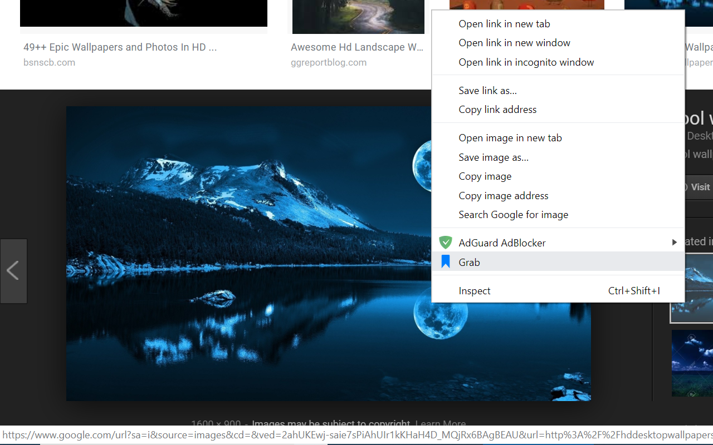

# Bookmark Manager

This is a chrome extension for advanced bookmarking.
Image and videos are able to be bookmarked. Unlike regular bookmarks, tags can be added and later searched for.





Instructions
===
You can bookmark pages and media by right-clicking
and selecting the bookmark manager icon in the context menu.

Clicking on the bookmark manager icon on the top right of the browser will open the gallery, where all bookmarks saved through the extension will be displayed.

The extension can be installed into chrome by navigating to the extensions settings page and clicking "load unpacked".

Build
===

Prebuilt: [https://github.com/tniyer2/bookmark-manager-nodejs/releases/tag/2.0.0](https://github.com/tniyer2/bookmark-manager-nodejs/releases/tag/2.0.0)

Run below to to build the extension. NPM must be installed.

```
npm build
```

Built extension will be stored in ./front_end/dist.
